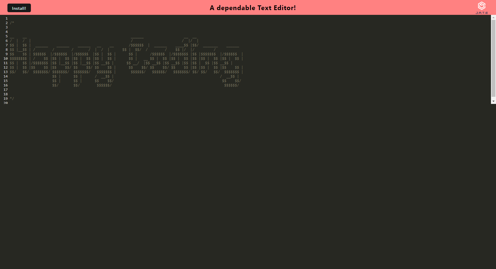

# Offline Code Editor
> Module 19 - Progressive Web Applications (PWA) Challenge: Text Editor

[](https://opensource.org/licenses/MIT)


## Table of Contents
  
  * [Description](#description)
  * [Features](#features)
  * [Installation](#installation)
  * [Technologies](#technologies)
  * [Contributing](#contributing)
  * [License](#license)
  * [Questions](#questions)
<br><br>

## Description
This is a web-based text editor designed as a one-page application, accessible directly from your browser. The application meets Progressive Web App (PWA) criteria and incorporates a range of data persistence methods. These techniques provide backup solutions in case a particular option isn't compatible with the browser. Moreover, the application can be installed and is functional while offline, allowing usability regardless of your internet connection.

### [>> View the live Application here ➡️](https://offline-code-editor-6a12c9d49a7b.herokuapp.com/)



### Please remember to use Incognito mode!
To ensure accurate testing of the offline features for this application, kindly consider using Google Chrome's incognito mode or alternatevely open a new "guest session" in your browser. This will help prevent any interference from cookies, cache, or browser history that might affect the app's performance. 


## Features

- Create and edit notes or code snippets with a user-friendly text editor.
- Switch between online and offline modes and the text editor still functions in the browser without errors.
- Static assets, including HTML, service workers, and manifest files, using webpack.
- Click "Install: button to download the web application onto the desktop.
- Utilize IndexedDB for immediate database storage upon opening the text editor.

## Installation

Clone the repository:

```sh
git clone https://github.com/CypherNyx/offline-code-editor.git
```

Install the required dependencies:

```sh
npm install
```

Run the project in your local browser:

```sh
npm start
```
## Technologies
[](https://www.javascript.com/)
[](https://nodejs.org/)
[](https://expressjs.com/)<br><br>


<br><br>


## Contributing
Pull requests are welcome. Please open an issue first to discuss any proposed changes or additions.
<br>

## License
[](https://opensource.org/licenses/MIT)
  
  https://opensource.org/licenses/MIT <br> 
  This project is open source and available under the MIT License.

<br>

  ## Questions
  GitHub [Dahlia Guido](https://github.com/CypherNyx)<br>
  Email: dguido.dev@gmail.com